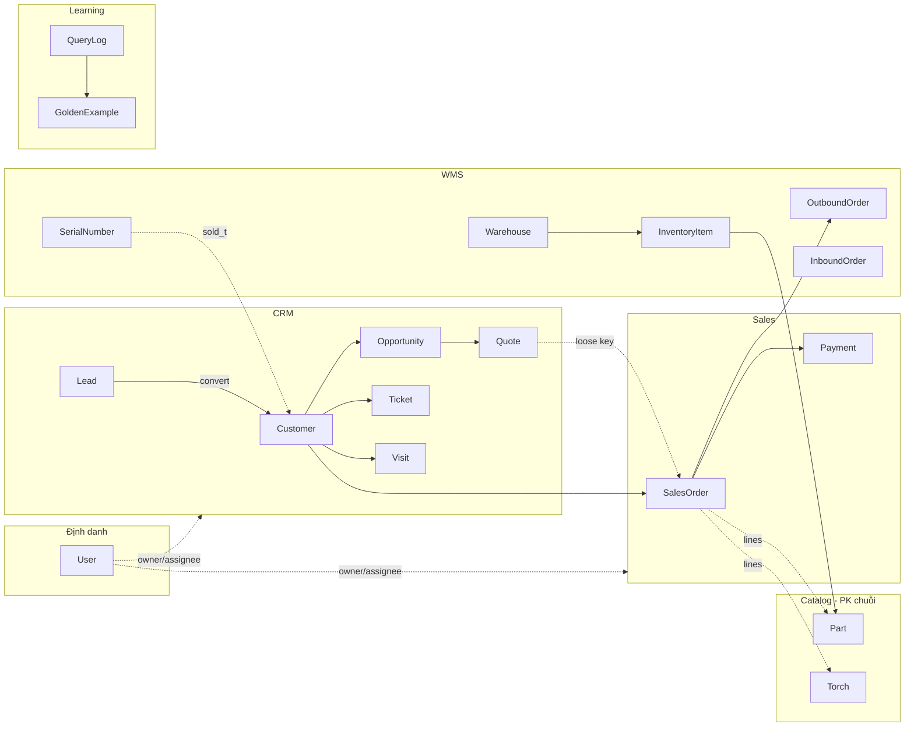
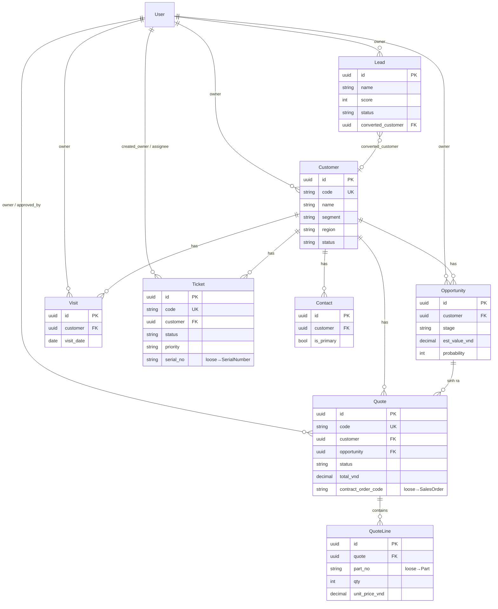
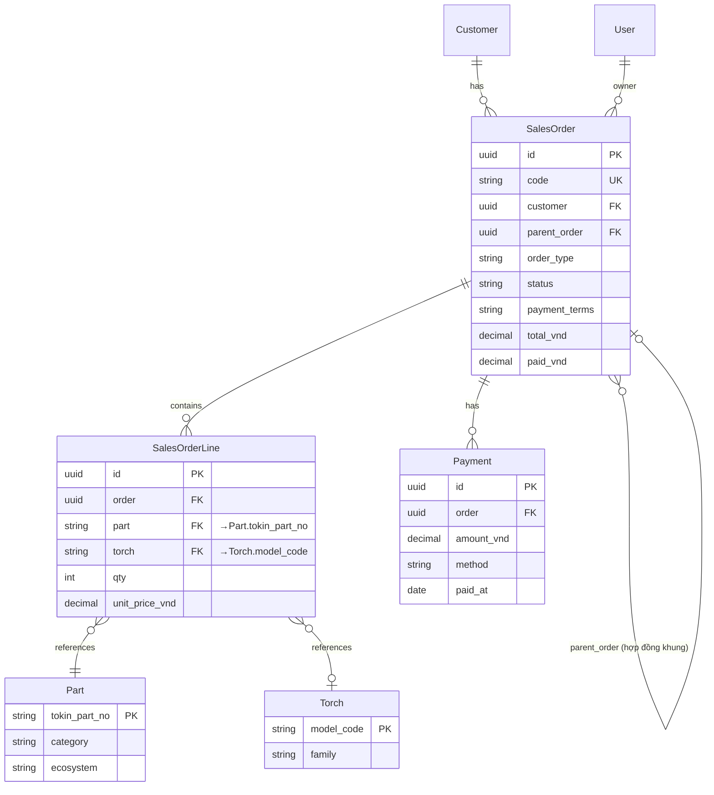
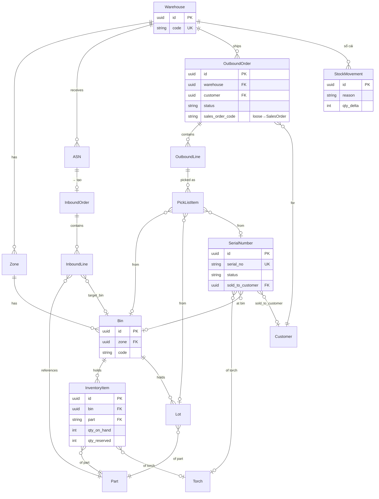
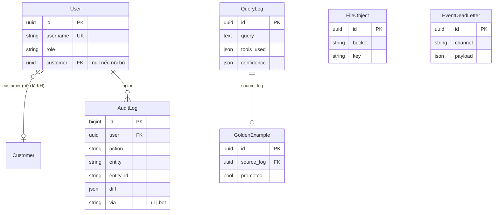

# TOKINARC V6 — ERD Tổng thể (Entity Relationship Diagram)

> **Phiên bản**: V6.dev2 — sinh từ CODE THẬT (56 model, 9 app), 06/2026.
> Sơ đồ dùng Mermaid `erDiagram` — mở trên GitHub/VS Code để render.
> Bổ sung cho B.2 (chi tiết field) và LLD_DataFlow (luồng). Tài liệu này tập trung
> **quan hệ giữa các bảng**.

---

## Quy ước đọc

- **PK in đậm trong mô tả**: catalog dùng PK chuỗi (`tokin_part_no`, `model_code`),
  còn lại UUID7.
- **Audit FK dùng chung**: mọi model kế thừa `BaseModel` đều có
  `created_by / updated_by / deleted_by → User`. Để sơ đồ gọn, các FK audit này
  **KHÔNG vẽ** trong ERD — chỉ vẽ quan hệ nghiệp vụ. Xem §6 để biết danh sách.
- Ký hiệu Mermaid: `||--o{` = một-nhiều, `||--||` = một-một, `}o--||` = nhiều-một.
- `..` (nét đứt) = **loose key** (CharField chứa mã, không phải FK ràng buộc DB).

---

## 1. Bản đồ domain (toàn cảnh)



---

## 2. CRM — quan hệ entity



**Chú ý loose key** (nét `..` ở §1): `Quote.contract_order_code`, `QuoteLine.part_no`,
`Ticket.serial_no` là chuỗi mã, **không** FK — để tránh phụ thuộc cứng / circular import.

---

## 3. Sales + liên kết Catalog



> Khác CRM: SalesOrderLine dùng **hard FK** tới Part/Torch (đơn bán cần ràng buộc
> toàn vẹn), trong khi QuoteLine dùng loose key (báo giá linh hoạt hơn).

---

## 4. WMS — kho, tồn, serial, nhập/xuất



> `OutboundOrder.sales_order_code` là **loose key** sang Sales (xem EXTENDING §3) —
> sẽ nâng thành FK khi sales↔wms gắn chặt.

---

## 5. Cross-cutting: Identity · Learning · Storage · Audit



- `User.role` ∈ {customer, sales, warehouse, service, manager, admin} — xem `roles.py`.
- `User.customer` chỉ set khi user là **khách** (đăng nhập tra cứu); nội bộ = null.
- `EventDeadLetter`: event xử lý thất bại → lưu để retry (hỗ trợ event bus).

---

## 6. Audit FK dùng chung (không vẽ trong ERD trên)

Mọi model kế thừa `BaseModel` (apps/common) có sẵn 3 FK tới `User`, **bỏ khỏi sơ đồ**
để gọn. Các model có audit FK: Customer, Contact, Lead, Opportunity, Quote, Visit,
Ticket, SalesOrder, Payment, Warehouse, Zone (qua warehouse), SerialNumber,
ASN, InboundOrder, OutboundOrder, FileObject.

```
BaseModel (abstract):
    id          UUID7 PK
    created_at  / created_by → User
    updated_at  / updated_by → User
SoftDeleteMixin (abstract):
    is_deleted  / deleted_at / deleted_by → User
```

---

## 7. Bảng tổng hợp 56 model theo app

| App | Số model | Model |
|---|---|---|
| accounts | 1 | User |
| common | 1 | AuditLog |
| catalog | 13 | Torch, Part, CompatibilityEdge, TorchPartMapping, ProcessEdge, GasFlowEdge, ConsumableSet, ConsumableSetItem, NegativeRule, CategoryVocabulary, PartNoAlias, PartEmbedding, SeedMeta |
| crm | 8 | Customer, Contact, Lead, Opportunity, Quote, QuoteLine, Visit, Ticket |
| sales | 3 | SalesOrder, SalesOrderLine, Payment |
| wms | 13 | Warehouse, Zone, Bin, InventoryItem, SerialNumber, Lot, ASN, InboundOrder, InboundLine, OutboundOrder, OutboundLine, PickListItem, StockMovement |
| analytics | 0 | (đọc qua aggregate/MV, không có bảng riêng) |
| storage | 1 | FileObject |
| learning | 3 | QueryLog, GoldenExample, EventDeadLetter |

**Tổng: 43 model nghiệp vụ** (chưa tính bảng phụ Django như token blacklist).

---

## 8. Ba điểm thiết kế cần nhớ khi đụng schema

1. **Catalog PK là chuỗi** (`tokin_part_no`, `model_code`), không UUID. FK trỏ tới
   catalog phải dùng đúng kiểu chuỗi.
2. **Hard FK vs loose key**: Sales dùng hard FK tới Part/Torch (toàn vẹn);
   CRM/WMS dùng loose key ở ranh giới giữa app (linh hoạt, tránh circular). Xem nét
   `..` ở §1 và ghi chú từng bảng.
3. **PartEmbedding** có `VectorField(1024)` + HNSW — migration portable Postgres/SQLite
   (xem EXTENDING §9.1). Đừng auto-generate migration cho bảng này.
