# TOKINARC V6 — Low-Level Design & Data Flow

> **Phiên bản**: V6.C-fix3 (cập nhật theo code thật, 06/2026)
> **Phạm vi**: CRM · WMS · CEO/Analytics · Chatbot.
> **Nguồn sự thật**: tài liệu này bám theo CODE hiện tại, không phải bản B.5 cũ.
> Sơ đồ dùng Mermaid — mở trên GitHub/VS Code để render.
>
> ⚠️ **Khác bản kiến trúc B.5 cũ** (đã lỗi thời):
> - B.5 ghi "11 tool" → thực tế **27 tool**.
> - B.5 ghi tool đọc "query Postgres trực tiếp" → thực tế **tool đọc gọi Django REST** qua `tool_clients.py`.
> - B.5 ghi retrieval "BM25 + Vector + PQA" → thực tế mới **ILIKE** (vector search chưa làm).
> - CRM mở rộng, `READ_TOOL_REQUIREMENTS`, `dump_roles`, Gemini on/off: chưa có trong B.5.

---

## 0. Bản đồ thành phần

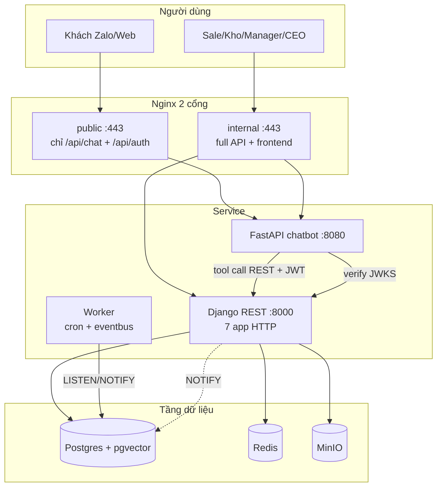

**7 app Django phục vụ HTTP**: accounts, catalog, crm, sales, wms, analytics, storage.
(`common` = tầng base; `learning` = chạy qua worker, không expose HTTP.)

---

## 1. CHATBOT — Data flow end-to-end

> ⚠️ Phần CHATBOT (§1, §2) dưới đây mô tả chatbot sidecar CŨ (27 tool gọi Django). Chatbot THẬT hiện tại là FastAPI v8.0 độc lập (X-API-Key, 11 tool in-process, retrieval tự chứa). Xem `chatbot/README.md`. Phần CRM/WMS/Analytics/Event-bus (§3 trở đi) vẫn ĐÚNG với backend.

### 1.1 Pipeline thật (theo `chatbot/main.py::query_v2`)

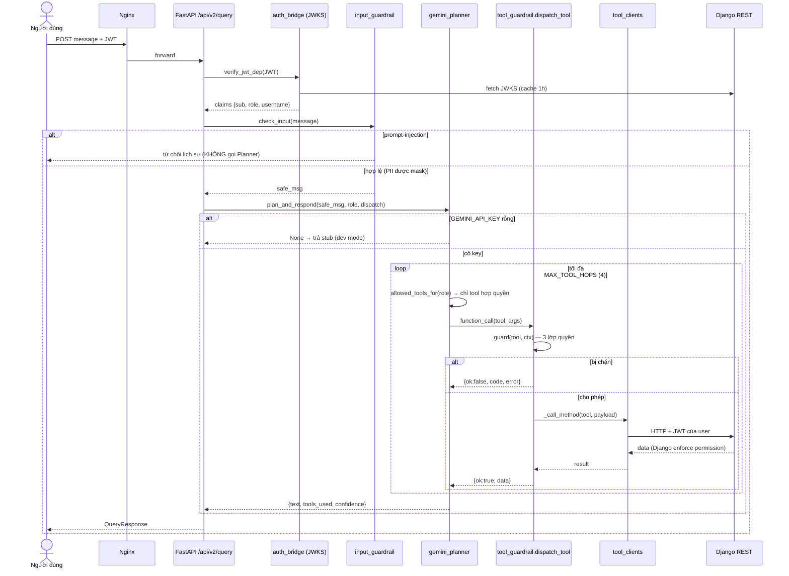

### 1.2 Endpoint chatbot (FastAPI)

| Method | Path | Auth | Vai trò |
|---|---|---|---|
| GET | `/api/v1/health/live` | không | liveness probe |
| GET | `/api/v1/health/ready` | không | readiness (DB/JWKS) |
| GET | `/api/v1/whoami` | JWT | trả claims |
| POST | `/api/v2/query` | JWT | endpoint chính |
| POST | `/api/v5/query` | JWT | tương thích cũ → forward v2 |
| POST | `/api/v1/tool/dispatch` | JWT | gọi 1 tool trực tiếp (debug/UI) |

### 1.3 Phân quyền chatbot — 3 lớp (defense-in-depth)

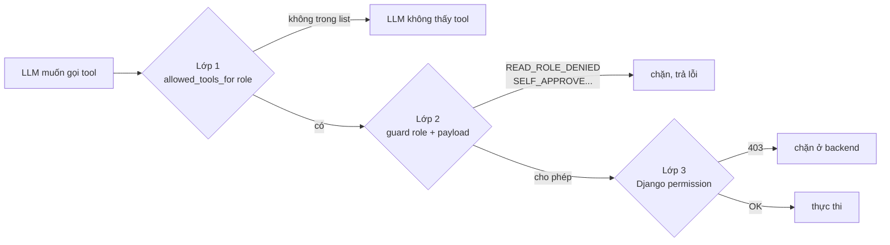

- **Lớp 1** `gemini_planner.allowed_tools_for(role)` — Gemini chỉ *thấy* tool role được phép.
- **Lớp 2** `tool_guardrail.guard()` — chặn lần cuối ở sidecar (role + validate payload).
- **Lớp 3** Django REST permission (`IsManagerOrAdmin`, `SalesPermission`...) — chặn thật.

---

## 2. 27 TOOL — LLD đầy đủ

### 2.1 Bảng tool (kind · role · endpoint · kiểu dispatch)

Kiểu dispatch (`tool_guardrail._TOOL_CALL_SPEC`): **pos** = positional, **dict** = truyền nguyên dict, **kw** = `**payload`.

| # | Tool | Kind | Role | Endpoint | Dispatch |
|---|---|---|---|---|---|
| 1 | search_parts | đọc | mọi (+khách) | GET /catalog/parts/search/ | kw |
| 2 | get_part | đọc | mọi (+khách) | GET /catalog/parts/{id}/ | kw |
| 3 | get_torch | đọc | mọi (+khách) | GET /catalog/torches/{id}/ | kw |
| 4 | get_customer | đọc | nội bộ | GET /crm/customers/{id}/ | kw |
| 5 | get_customer_360 | đọc | nội bộ | GET /crm/customers/{id}/360/ | kw |
| 6 | list_customers | đọc | nội bộ | GET /crm/customers/ | kw |
| 7 | get_inventory | đọc | nội bộ | GET /wms/inventory/ | kw |
| 8 | get_serial_history | đọc | nội bộ | GET /wms/serials/{id}/ | kw |
| 9 | get_kpi_overview | đọc | manager/admin | GET /analytics/kpi/overview/ | kw |
| 10 | get_revenue_monthly | đọc | manager/admin | GET /analytics/revenue/monthly/ | kw |
| 11 | get_revenue_by_segment | đọc | manager/admin | GET /analytics/revenue/by-segment/ | kw |
| 12 | get_debt_aging | đọc | manager/admin | GET /analytics/debt-aging/ | kw |
| 13 | get_inventory_value | đọc | manager/admin | GET /analytics/inventory/value/ | kw |
| 14 | get_pipeline_forecast | đọc | manager/admin | GET /analytics/forecast/pipeline/ | kw |
| 15 | get_purchasing_summary | đọc | manager/admin | GET /wms/inbound/?summary=1 | kw |
| 16 | create_quote | ghi | sale/manager/admin | POST /crm/quotes/ | dict |
| 17 | approve_quote | ghi | manager/admin | POST /crm/quotes/{id}/approve/ | pos |
| 18 | quote_to_contract | ghi | sale/manager/admin | POST /crm/quotes/{id}/to-contract/ | pos |
| 19 | move_opportunity_stage | ghi | sale/manager/admin | POST /crm/opportunities/{id}/move-stage/ | pos |
| 20 | create_visit | ghi | sale/manager/admin | POST /crm/visits/ | dict |
| 21 | create_ticket | ghi | sale/service/mgr/admin | POST /crm/tickets/ | dict |
| 22 | sign_order | ghi | manager/admin | POST /sales/orders/{id}/sign/ | pos |
| 23 | ship_order | ghi | sale/kho/mgr/admin | POST /sales/orders/{id}/ship/ | pos |
| 24 | create_payment | ghi | manager/admin | POST /sales/payments/ | dict |
| 25 | wms_pick_confirm | ghi | kho/manager/admin | POST /wms/outbound/{id}/ship/ | pos |
| 26 | wms_adjust_inventory | ghi | kho/manager/admin | POST /wms/inventory/adjust/ | dict |
| 27 | wms_transfer_stock | ghi | kho/manager/admin | POST /wms/inventory/transfer/ | dict |

(prefix mọi endpoint: `/api/v1`)

### 2.2 Nguồn quyền — single source

```
apps/accounts/roles.py   ← SINGLE SOURCE
  ├── READ_TOOLS, READ_TOOL_REQUIREMENTS, WRITE_TOOL_REQUIREMENTS
  └── dump_roles command → sinh:
        ├── chatbot/roles_generated.py  (fallback khi chatbot chạy tách)
        └── frontend/src/lib/auth/roles.ts (khi FE sẵn sàng)
  CI bước "Check role tables sync" chặn lệch.
```

---

## 3. CRM — LLD & Data Flow

### 3.1 Entity & quan hệ

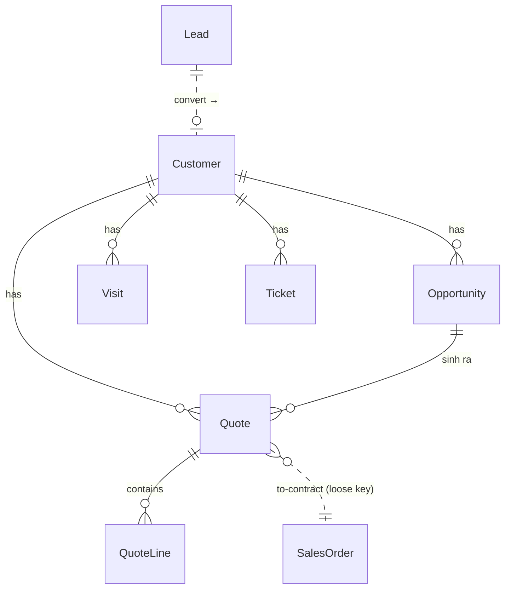

- **Lead**: KH tiềm năng, có `score` (AI), `convert` → tạo Customer (link ngược).
- **Opportunity**: cơ hội, state machine 6 bước.
- **Quote + QuoteLine**: báo giá; `total_vnd` **tính ở server** từ lines.
- **Visit**: báo cáo viếng thăm (có GPS check-in).
- **Ticket**: phiếu hỗ trợ/bảo hành; `serial_no` loose key sang WMS.

### 3.2 State machine — Quote

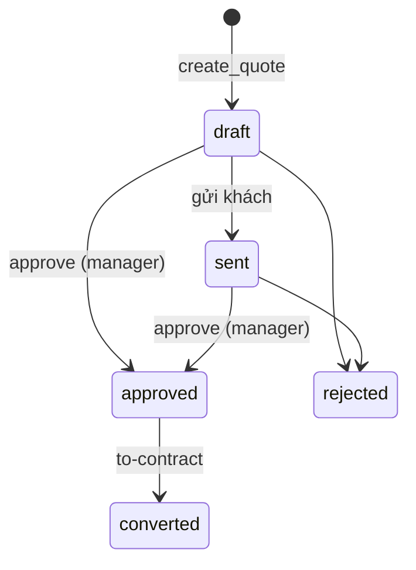

Quy tắc enforce ở `views_ext.py`:
- `approve`: chỉ manager/admin; **không tự duyệt** quote của mình (trừ admin).
- `to-contract`: chỉ khi `status == approved` → sinh `contract_order_code` (HD-xxxx).

### 3.3 State machine — Opportunity

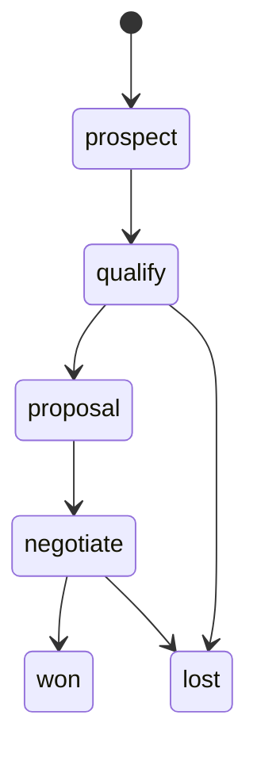

### 3.4 Data flow — Tạo báo giá qua chatbot

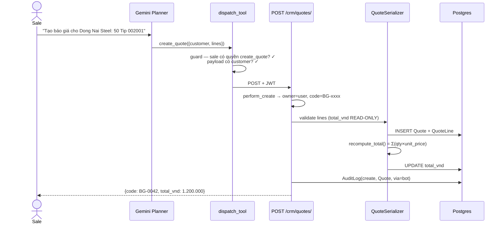

**Điểm chốt bảo mật**: `total_vnd` nằm trong `read_only_fields` → client/bot gửi
giá trị gì cũng bị bỏ; server luôn tự tính từ lines.

### 3.5 Ownership filter

```
_own_filter(qs, user):
    is_manager(user) → toàn bộ
    else            → chỉ owner_id == user.id
```
Áp cho Lead/Opportunity/Quote/Visit. Ticket: service + manager thấy hết, sale chỉ của mình.

---

## 4. WMS — LLD & Data Flow

### 4.1 State machine — Inbound (nhập kho)

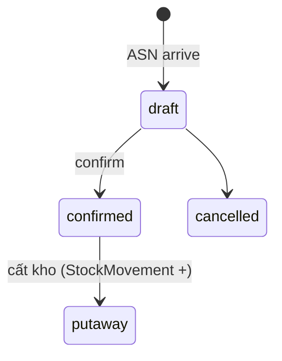

### 4.2 State machine — Outbound (xuất kho)

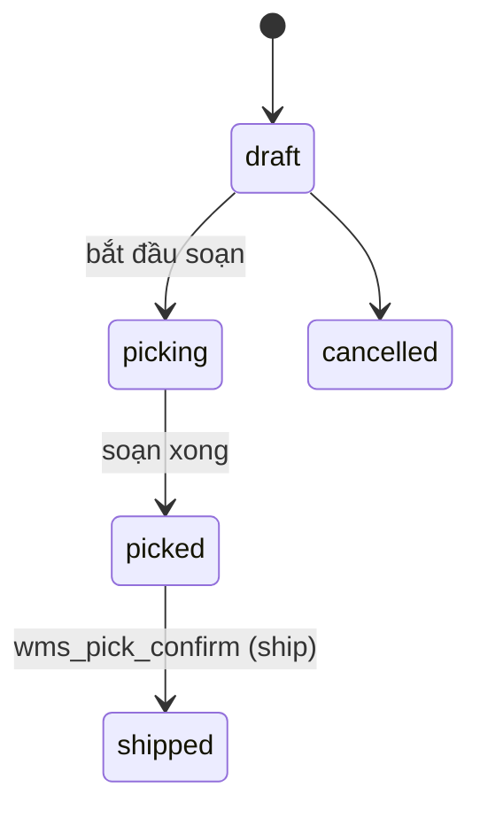

### 4.3 Inventory — adjust & transfer (data flow)

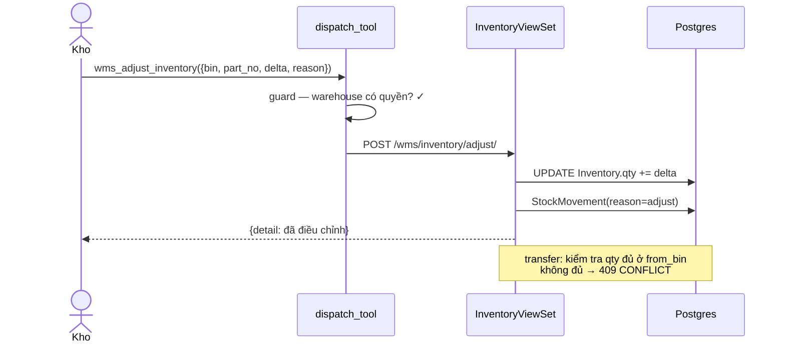

### 4.4 Đối tượng dữ liệu chính

- `Warehouse → Zone → Bin` (phân cấp vị trí).
- `Inventory` (tồn theo bin × part), `SerialNumber` (6 trạng thái: in_stock/reserved/shipped/sold/returned/scrapped).
- `StockMovement` (sổ cái mọi thay đổi tồn: inbound/outbound/adjust/transfer/return).
- `Lot` (lô + hạn dùng, cho FEFO).
- Quy tắc xuất: FIFO / FEFO / NEAREST (`OutboundRule`).

---

## 5. CEO / ANALYTICS — LLD & Data Flow

### 5.1 Phân quyền

Tất cả view analytics kế thừa `_Base` với `IsManagerOrAdmin`:
```python
role in ('manager', 'admin')   # sale/kho/khách → 403
```
Đây là tầng chặn THẬT cho mọi báo cáo tài chính (tool 9-15).

### 5.2 Endpoint → dữ liệu

| Endpoint | Trả về | Nguồn (hiện tại) |
|---|---|---|
| /analytics/kpi/overview/ | KPI tổng hợp | aggregate trực tiếp |
| /analytics/revenue/monthly/ | doanh thu theo tháng | SalesOrder/Payment aggregate |
| /analytics/revenue/by-segment/ | doanh thu theo phân khúc | join Customer.segment |
| /analytics/debt-aging/ | công nợ theo tuổi nợ | SalesOrder chưa thu |
| /analytics/inventory/value/ | giá trị tồn (tiền) | Inventory × giá |
| /analytics/forecast/pipeline/ | dự báo từ pipeline | Opportunity × probability |

> ⚠️ **Hiện trạng**: các view aggregate **trực tiếp** trên bảng giao dịch.
> **Kế hoạch** (chưa làm): chuyển sang **Materialized View** refresh theo cron
> (`refresh_mv`) để giảm tải — xem §7.

### 5.3 Data flow — CEO hỏi doanh thu qua chat

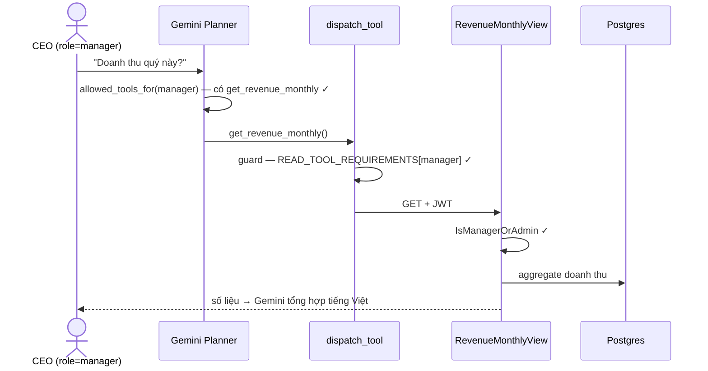

Nếu **sale** hỏi cùng câu: Lớp 1 không đưa tool cho Gemini; nếu cố gọi, Lớp 2 trả
`READ_ROLE_DENIED`; nếu vẫn lọt, Lớp 3 (`IsManagerOrAdmin`) trả 403.

---

## 6. EVENT BUS & AUDIT — cross-cutting

### 6.1 Event bus (Postgres LISTEN/NOTIFY)

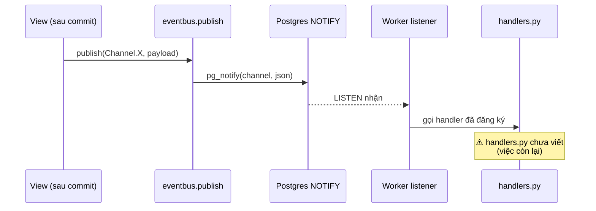

Channel = single source ở `tokinarc/eventbus/channels.py`.

### 6.2 Audit log

Mọi thao tác ghi → `AuditLog(user, action, entity, entity_id, diff, via)`.
`via` = `bot` nếu header `X-Via: bot`, ngược lại `ui`. Phân biệt được thao tác
nào do chatbot thực hiện.

---

## 7. HIỆN TRẠNG vs KẾ HOẠCH (đối chiếu code — cập nhật sau merge chatbot thật)

> Bảng này phản ánh trạng thái SAU khi gộp chatbot thật v8.0 + thêm event
> handlers + FE slice 1. (Các dòng "27 tool / 3 lớp / sidecar" cũ đã bỏ.)

### Backend (Django — CRM/WMS/CEO)

| Hạng mục | Trạng thái |
|---|---|
| 7 app HTTP + auth JWT/JWKS (login nhân viên) | ✅ chạy |
| CRM mở rộng (Lead/Opp/Quote/Visit/Ticket) | ✅ có + test |
| WMS (warehouse/bin/inventory/serial/inbound/outbound) | ✅ có + test |
| Sales (order/payment/debt) | ✅ có + test |
| Analytics (6 endpoint, IsManagerOrAdmin) | ✅ có + test |
| Phân quyền backend per-role | ✅ có + ~48 test |
| Event handlers thật (`apps/sales/handlers.py` + apps.ready) | ✅ có + test (mẫu: payment_received, order_shipped) |
| Event bus LISTEN/NOTIFY (channels/publisher/listener) | ✅ có |
| Analytics qua Materialized View | 🟡 có `refresh_mv` command, view hiện vẫn aggregate trực tiếp (chưa chuyển sang MV) |

### Chatbot (FastAPI v8.0 THẬT — độc lập)

| Hạng mục | Trạng thái |
|---|---|
| Pipeline /api/v2/query (Gemini function-calling) | ✅ chạy |
| 11 tool in-process (`core/tool_wrappers.py`) | ✅ có |
| Vector search FAISS (bge-m3) + BM25 + Procedural-QA | ✅ có (index sẵn trong `indexes/`) |
| Vision (phân tích ảnh phụ tùng) | ✅ có |
| WebSocket `/ws/query` streaming | ✅ có |
| Auth X-API-Key | ✅ có |
| Eval harness (`run_eval.py` + eval_700.json) | ✅ có |

> Lưu ý: chatbot KHÔNG gọi Django. Phân quyền role kiểu "3 lớp/sidecar" của
> thiết kế cũ KHÔNG còn áp dụng.

### Frontend (React)

| Hạng mục | Trạng thái |
|---|---|
| Slice 1: Login + Customers (gọi API thật) | ✅ có, build sạch |
| FE Dockerfile build thật (npm ci && build) | ✅ có |
| `RequireRole` guard theo role (B4) | 🟡 đã thiết kế, CHƯA code (làm khi dựng trang WMS/CEO) |
| Các trang CRM/WMS/CEO còn lại (~40 trang) | ⛔ chưa — roadmap |

---


## 8. Quy ước LLD (cho dev mở rộng)

- Entity nghiệp vụ → kế thừa `BaseModel` (UUID7) + `SoftDeleteMixin`.
- Catalog → PK string (`tokin_part_no`, `model_code`), KHÔNG UUID.
- Index phải đặt `name=` tường minh (tránh drift — xem EXTENDING.md §2).
- Tool mới: thêm client + schema (`gemini_planner`) + quyền (`roles.py`) + dispatch spec nếu positional.
- Liên kết app khác chưa tồn tại → loose key (CharField + db_index), nâng FK sau.
- Chi tiết quy trình: xem `EXTENDING.md`.
